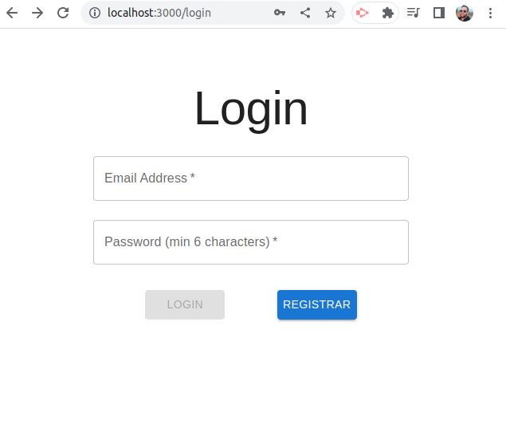
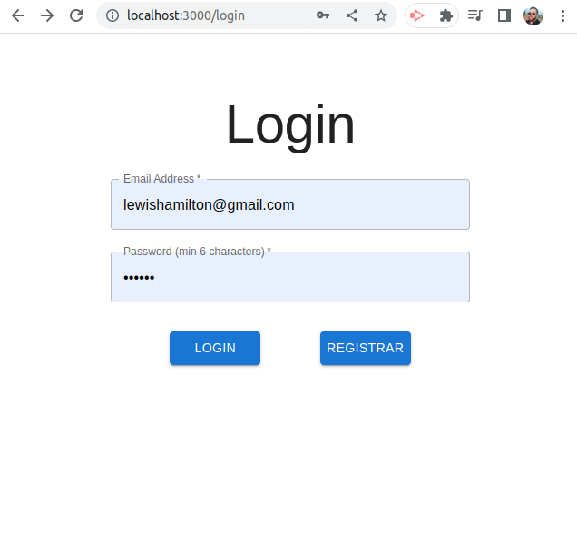
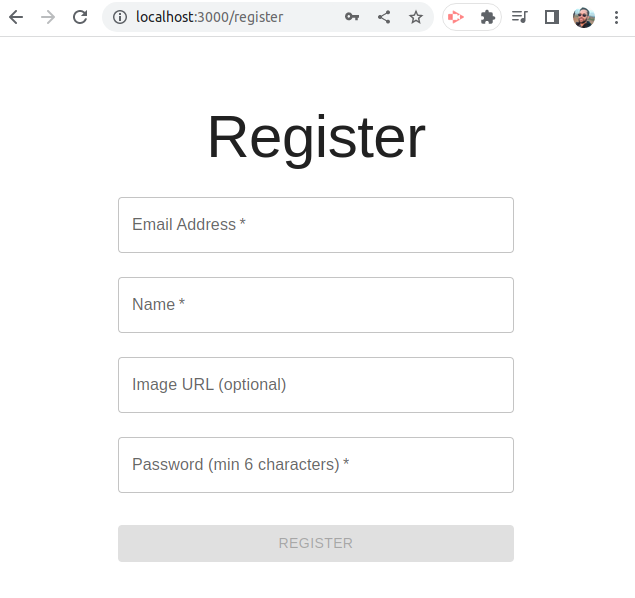
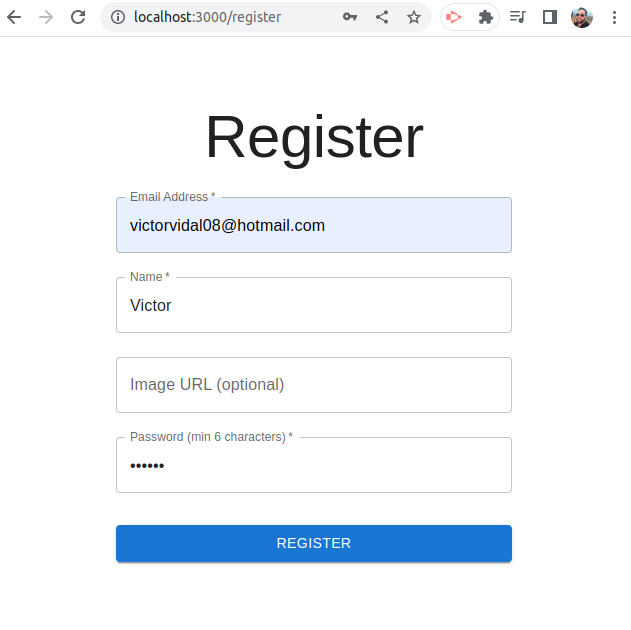
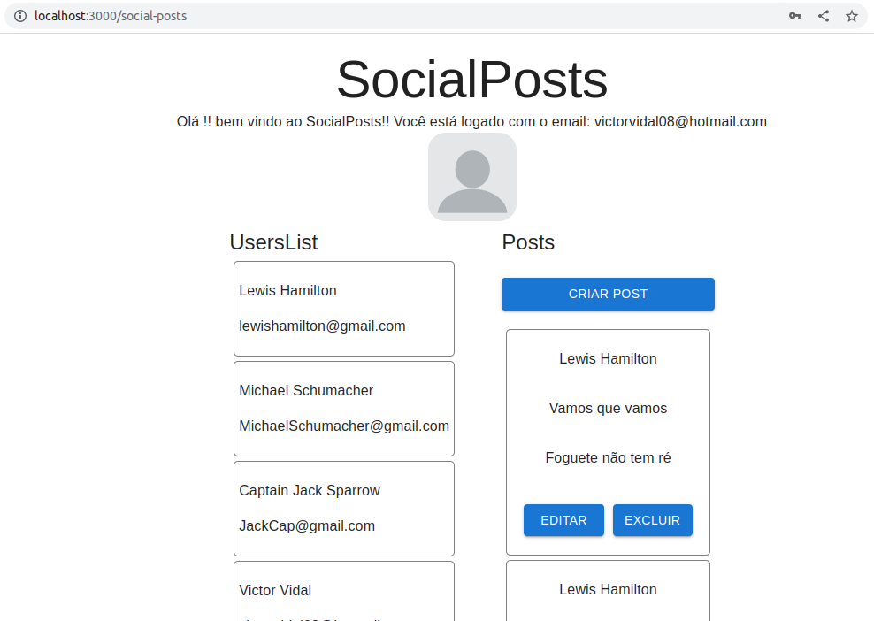
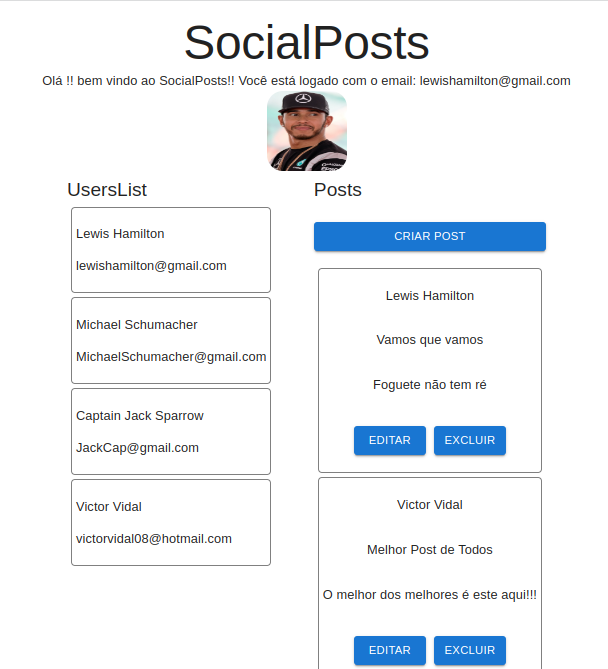
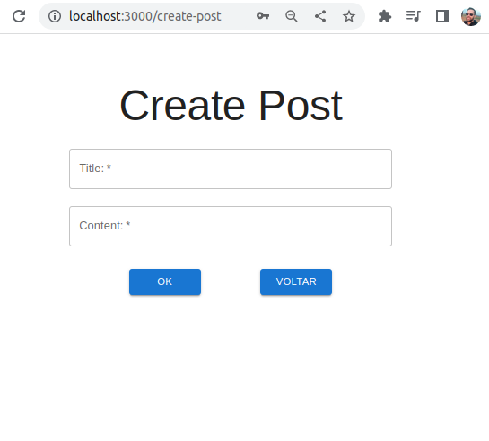
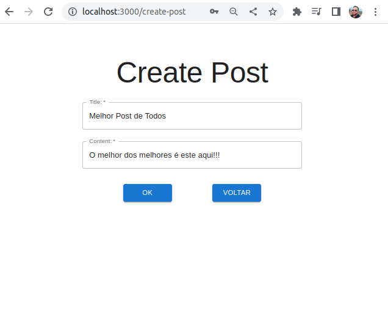
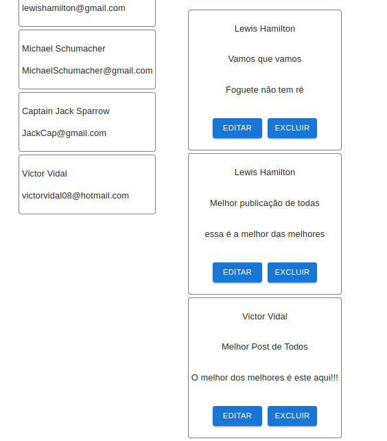
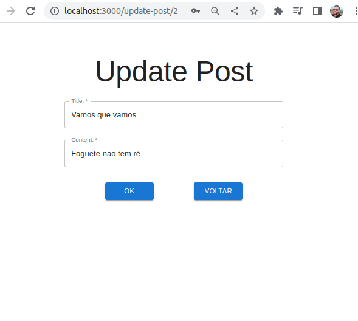

# Boas vindas ao repositório frontEnd do projeto <b>Social Media</b>!

Esse projeto foi desenvolvido como teste técnico da WAID!!

Aqui você vai encontrar os detalhes de como foi o desenvolvimento do projeto e quais foram os requisitos técnicos necessários para a entrega do desafio.

---
# Desafios do projeto:

CRUD é um acrônimo para **C**reate, **R**ead, **U**pdate and **D**elete. Em português seria **Criar**, **Ler**, **Atualizar** e **Deletar** registros. Nesse projeto trabalhei diretamente com a manipulação no banco de dados MySQL, utilizando do ORM Sequelize para a manipulação do banco, onde estão registrados as tabelas de usuários (Users) e seus respectivos posts (SocialPosts).

--- 

# Principais Tecnologias utilizadas:

- React;
- TypesScript;
- MaterialUi para estilização;
- Axios para conexão com backend.

---
## Como rodar o projeto:
### ⚠️⚠️⚠️ Importante ⚠️⚠️⚠️

⚠️⚠️Para o front-end funcionar perfeitamente, o backend da aplicação deve estar funcionando.⚠️⚠️

Para subir o backend da aplicação, deve ser seguido o tutorial no Readme do repositório: https://github.com/VictorVidal08/backend-waid 

Clone a aplicação com o comando: 
```
git clone git@github.com:VictorVidal08/frontend-waid.git
```
Entre no diretório da aplicação:
```
cd frontend-waid
```
Instale as dependências do projeto:
```
npm install
```
Inicie a aplicação:
```
npm start
```

O projeto utiliza as portas 3306 (base de dados), 3001 para o backend 3000 para frontend. Estas portas precisam estar livres para que a aplicação funcione.

---

## Telas:

### Login:

#### Página de Login com botão desabilitado:

</br>

#### Página de Login com botão habilitado (informações preenchidas corretamente):

</br>

---

### Register:

#### Página de Cadastro de usuário com botão desabilitado:

</br>

#### Página de Cadastro de usuário com botão habilitado (informações preenchidas corretamente):

</br>

---

### Main Page:
#### Página principal da aplicação com imagem genérica (caso o usuário não cadastre uma imagem):

</br>

#### Página principal da aplicação com imagem cadastrada pelo usuário:

</br>

---
### Create Post:
#### Página de criação de novos posts (sem informações preenchidas):

</br>

#### Página de criação de novos posts (com informações preenchidas corretamente):

</br>

#### Página de principal com novo post criado:

</br>

---

### Update Post:
#### Página de edição de post existente:

</br>

---
## Próximos passos:

Implementação de testes.

---